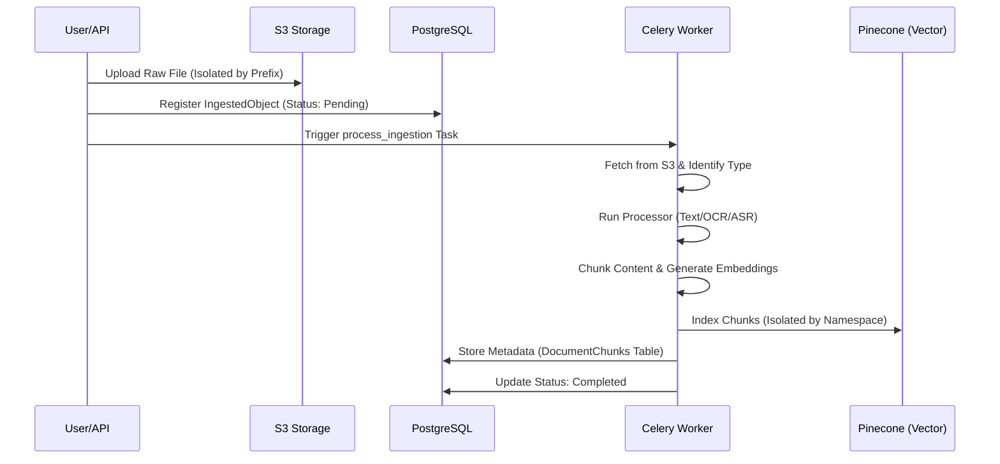
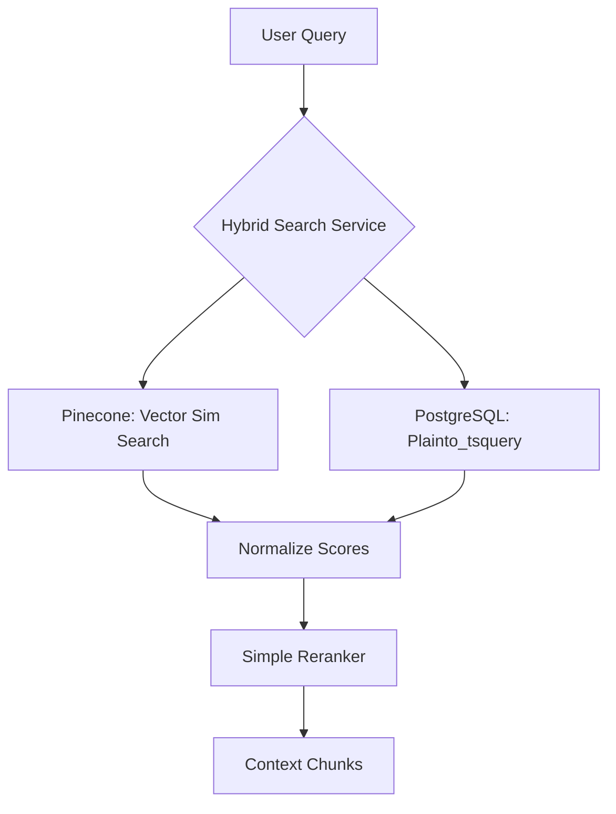
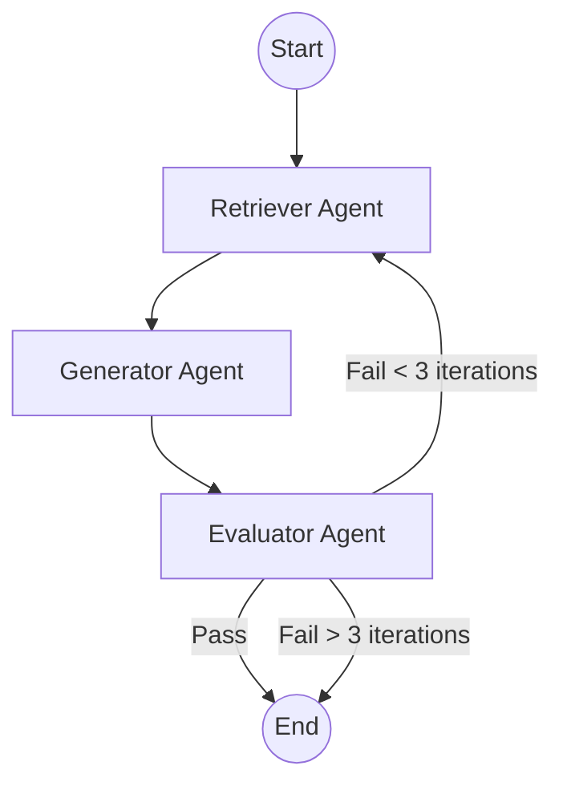

# Technical Deep Dive: Agentic RAG Platform

This document provides an in-depth explanation of the three pillars of our platform: **Multi-Modal Ingestion**, **Hybrid Retrieval**, and **Self-Improving Agentic Orchestration**.

---

## 1. The Ingestion Process (End-to-End)

The ingestion pipeline is designed to be asynchronous, multi-modal, and strictly isolated by tenant.

### The Flow

### Key Concepts
- **Multi-Modal Processors**: We use a `BaseProcessor` strategy. While the current implementation handles Text and Images (OCR placeholder), the architecture allows adding `VideoProcessor` or `AudioProcessor` by simply extending the base class and registering it in the task factory.
- **Tenant Isolation**: Every object in S3 is prefixed with `/{tenant_id}/`. Every vector in Pinecone is stored within a `namespace` named after the `tenant_id`. This ensures zero data leakage at the infra level.
- **Content Chunking**: We use a semantic-aware chunking strategy (overlapping windows) to preserve context across chunk boundaries, preventing "broken" answers during retrieval.

---

## 2. The Retrieval Process (Hybrid Search)

Retrieval in this system combines the precision of keyword matching with the semantic depth of vector embeddings.

### The Logic
We implement **Hybrid Search** using a reciprocal rank fusion (RRF) inspired approach:
1. **Semantic Search (Vector)**: Finds chunks that are conceptually similar to the query, even if keywords don't match (e.g., "automobile" matching "car").
2. **Keyword Search (BM25/FTS)**: Uses PostgreSQL Full-Text Search to find exact matches, specific technical IDs, or rare terms that vectors might miss.

### Why Hybrid?
Vector search alone can hallucinate similarity or fail on technical identifiers. Keyword search alone fails on synonyms. Hybrid search bridges this gap.

### The Query Flow

---

## 3. The Self-Improving Process (Agentic Loop)

Unlike standard RAG, which is a straight line (Query -> Retrieve -> Generate), our system uses **LangGraph** to create a self-correcting loop.

### The Agentic Graph

### Components of Self-Improvement
- **The Evaluator Agent**: This agent acts as a "Judge". It uses G-Eval style metrics to score the generated response:
    - **Faithfulness**: Is the answer derived *only* from the provided context?
    - **Relevance**: Does the answer actually address the user's question?
    - **Hallucination**: Does the answer contain facts not present in the context?
- **Self-Correction Logic**: If the Evaluator gives a low score or detects a hallucination, the system triggers a **re-retrieval**. It might broaden the search query or fetch more chunks to "prime" the generator with better info.
- **State management**: LangGraph maintains the `AgentState` (query, context, response, iteration count), allowing the system to learn from previous failures in the same session.

### The "Loop" Concept
If the first attempt results in a hallucination, the orchestrator doesn't just return it. It sees the "hallucination: true" flag from the Evaluator and goes back to the Retrieval node, perhaps using a refined search strategy, until a high-fidelity answer is produced or the retry budget is exhausted.
