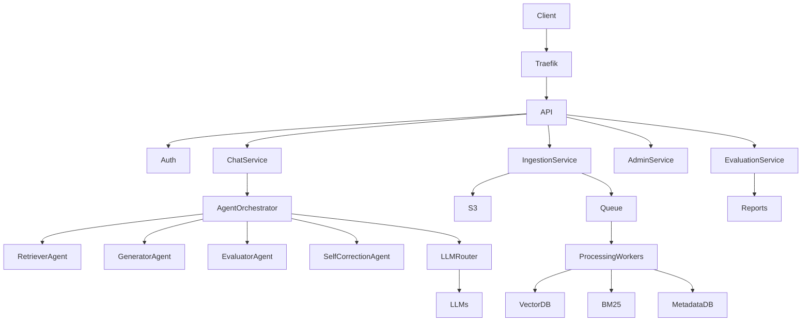
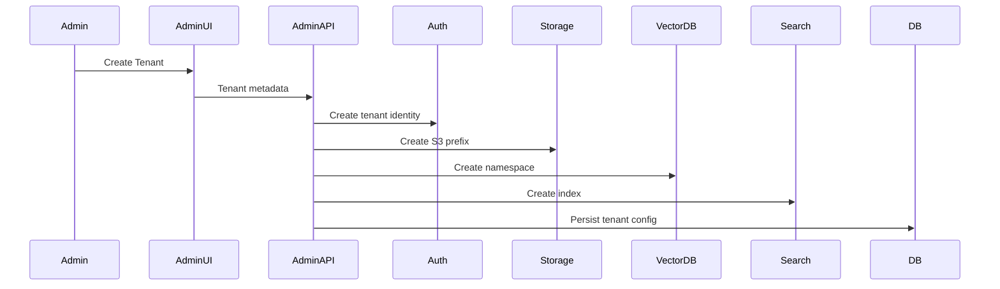
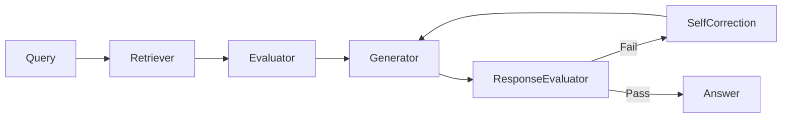
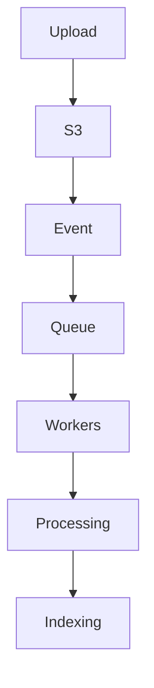
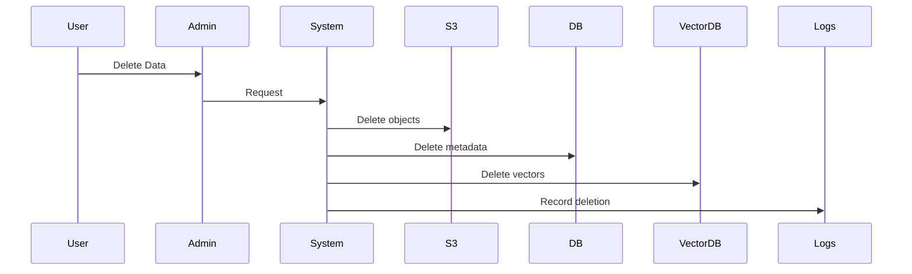

# **Agentic Conversational RAG Platform – Complete Design Document**

---

## 1. Vision & Goals

### 1.1 What We Are Building

A **multi-tenant, agentic, conversational RAG platform** that:

* Supports **multi-modal ingestion** (text, image, audio, video)
* Uses **multiple autonomous agents** (retrieve, evaluate, generate, self-correct)
* Scales to **1M+ ingestions/day** and **1M+ generations/day**
* Is **conversational**, retaining chat context
* Provides **RAG evaluation reports**
* Is **SOC2 Type II and GDPR compliant**
* Uses **Traefik as API Gateway**
* Is **LLM-agnostic and hot-swappable**
* Is **asynchronous by default**
* Is **fully Dockerized**
* Enforces **strict tenant isolation**
* Uploads all raw content to **S3**, storing only **CloudFront URLs**

---

## 2. High-Level Architecture

### 2.1 Logical Architecture



---

## 3. Multi-Tenancy Model

### 3.1 Tenant Hierarchy

```
System
 └── Admin (Global)
     └── Tenant
         ├── Users
         ├── Projects / Workspaces
         ├── Data Sources
         ├── Chat Sessions
         └── Models / Policies
```

---

### 3.2 Tenant Isolation (Hard Requirement)

| Layer          | Isolation Strategy                 |
| -------------- | ---------------------------------- |
| Authentication | Tenant ID embedded in JWT          |
| Authorization  | RBAC + Tenant scopes               |
| Storage (S3)   | `s3://bucket/{tenant_id}/`         |
| Vector DB      | Namespace per tenant               |
| Search Index   | Index per tenant                   |
| DB             | Tenant ID mandatory in every table |
| Cache          | Key prefix per tenant              |
| Rate Limits    | Per tenant quotas                  |

**No shared mutable state across tenants.**

---

## 4. Admin Dashboard & Tenant Onboarding

### 4.1 Preconfigured Super Admin

* System boots with a **single immutable super-admin**
* Stored via secure bootstrap secret
* Cannot be deleted via API

---

### 4.2 Admin Dashboard Capabilities

#### Tenant Management

* Create / suspend / delete tenants
* Assign quotas (ingestion, tokens, storage)
* Configure allowed LLMs
* Configure retention policies

#### Security & Compliance

* View audit logs
* Force key rotation
* Data deletion requests (GDPR)

#### Monitoring

* Token usage
* Retrieval accuracy
* Hallucination rate
* Cost per tenant

---

### 4.3 Tenant Onboarding Flow



---

## 5. Conversational RAG Design

### 5.1 Chat Session Model

Each conversation is a **first-class entity**.

```text
ChatSession
- id
- tenant_id
- user_id
- system_prompt
- created_at
- metadata
```

```text
ChatMessage
- id
- session_id
- role (user | assistant | system | tool)
- content
- references
- timestamp
```

---

### 5.2 Context Assembly Strategy

Before generation:

1. Retrieve **last N messages** (configurable)
2. Apply **conversation summarization** if token limit exceeded
3. Inject:

   * System prompt
   * Tenant rules
   * Retrieved documents
   * Chat memory

---

### 5.3 Memory Types

| Memory Type | Storage     |
| ----------- | ----------- |
| Short-term  | In-prompt   |
| Long-term   | Vector DB   |
| Summary     | Metadata DB |

---

## 6. Agentic RAG Architecture

### 6.1 Agent Types

| Agent                    | Responsibility               |
| ------------------------ | ---------------------------- |
| Retriever Agent          | Hybrid retrieval             |
| Content Evaluator Agent  | Score relevance              |
| Generator Agent          | Answer generation            |
| Response Evaluator Agent | Hallucination & completeness |
| Self-Correction Agent    | Regeneration                 |

---

### 6.2 Agent Orchestration



---

## 7. Hybrid Search & Reranking

### 7.1 Retrieval Layers

| Layer            | Purpose              |
| ---------------- | -------------------- |
| Vector Search    | Semantic similarity  |
| BM25             | Keyword precision    |
| Metadata Filters | Tenant, source, time |

---

### 7.2 Reranking Strategy

```
score = 
  0.5 * vector_score +
  0.3 * bm25_score +
  0.2 * metadata_score
```

Final rerank via:

* Cross-encoder
* Lightweight LLM judge

---

## 8. Multi-Modal Ingestion Pipeline

### 8.1 Supported Modalities

| Type  | Processing            |
| ----- | --------------------- |
| Text  | Chunking + embeddings |
| Image | OCR + captioning      |
| Audio | ASR                   |
| Video | ASR + keyframes       |

---

### 8.2 Ingestion Flow



---

## 9. RAG Evaluation & Reporting System

### 9.1 Evaluation Dimensions

| Metric        | Description         |
| ------------- | ------------------- |
| Faithfulness  | Grounded in sources |
| Relevance     | Matches query       |
| Coverage      | Complete answer     |
| Hallucination | Unsupported claims  |
| Latency       | SLA adherence       |

---

### 9.2 Evaluation Triggers

* Automatic (sampled)
* Admin-initiated
* CI / regression testing

---

### 9.3 Evaluation Reports

Reports include:

* Question
* Retrieved documents
* Generated answer
* Scores per dimension
* Failure analysis
* Cost

Reports are:

* Tenant-scoped
* Exportable (PDF / JSON)
* Immutable (audit-safe)

---

## 10. Hot-Swappable LLM Architecture

### 10.1 LLM Router

```text
LLMRouter
- tenant_id
- model_policy
- cost_policy
- fallback_chain
```

---

### 10.2 Swapping Without Downtime

* No agent references a concrete LLM
* All calls go through router
* Model updates via config only

---

## 11. Async & Scalability Model

### 11.1 Asynchronous Everywhere

| Layer     | Pattern            |
| --------- | ------------------ |
| APIs      | Async HTTP         |
| Agents    | Task DAG           |
| Ingestion | Event-driven       |
| Indexing  | Background workers |

---

### 11.2 Throughput Design

* Horizontal scaling
* Stateless services
* Backpressure via queues
* Batch embeddings

---

## 12. Traefik as API Gateway

### 12.1 Responsibilities

* TLS termination
* Rate limiting
* Auth middleware
* Routing
* Canary releases

---

### 12.2 Security Middleware

* JWT validation
* Tenant extraction
* Abuse protection

---

## 13. Dockerized Deployment

### 13.1 Core Services

| Service    | Role              |
| ---------- | ----------------- |
| api        | Public API        |
| ingest     | Ingestion workers |
| agents     | Orchestrator      |
| retrieval  | Hybrid search     |
| evaluation | RAG evaluation    |
| admin      | Admin backend     |
| frontend   | Dashboards        |

---

## 14. SOC2 Compliance Design

### 14.1 SOC2 Pillars

| Pillar          | Implementation   |
| --------------- | ---------------- |
| Security        | IAM, encryption  |
| Availability    | Redundancy       |
| Confidentiality | Tenant isolation |
| Integrity       | Checksums        |
| Auditability    | Logs             |

---

### 14.2 Audit Logging

* Every access logged
* Immutable storage
* Tenant-scoped visibility

---

## 15. GDPR Compliance Design

### 15.1 GDPR Requirements

| Requirement       | Implementation     |
| ----------------- | ------------------ |
| Right to access   | Export APIs        |
| Right to delete   | Cascading delete   |
| Data minimization | Metadata only      |
| Retention         | Configurable TTL   |
| Consent           | Explicit ingestion |

---

### 15.2 Data Deletion Flow



---

## 16. Security Best Practices

* Zero-trust networking
* Short-lived credentials
* Secrets via vault
* Encrypted storage
* No raw data in logs

---

## 17. Step-by-Step Implementation Roadmap

### Phase 1 – Platform Core

* Traefik
* Auth
* Multi-tenancy
* Admin bootstrap

### Phase 2 – Ingestion

* S3 + events
* Multi-modal processing
* Hybrid indexing

### Phase 3 – Conversational RAG

* Chat sessions
* Context handling
* Agent orchestration

### Phase 4 – Evaluation & Reporting

* Metrics
* Reports
* Dashboards

### Phase 5 – Compliance & Scale

* GDPR flows
* SOC2 controls
* Load testing

---